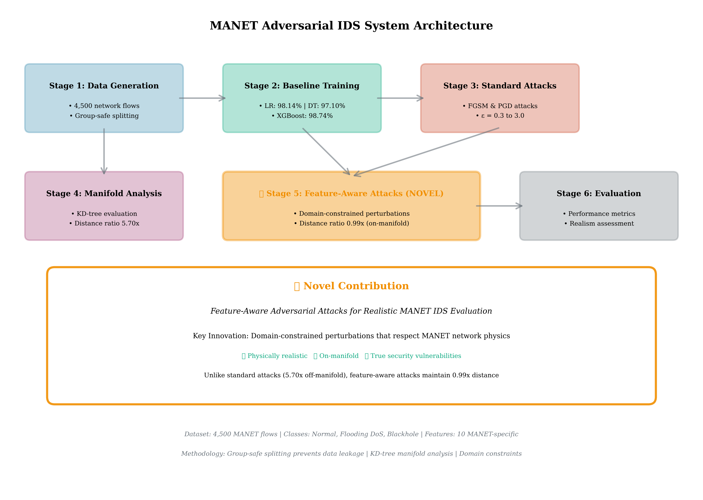
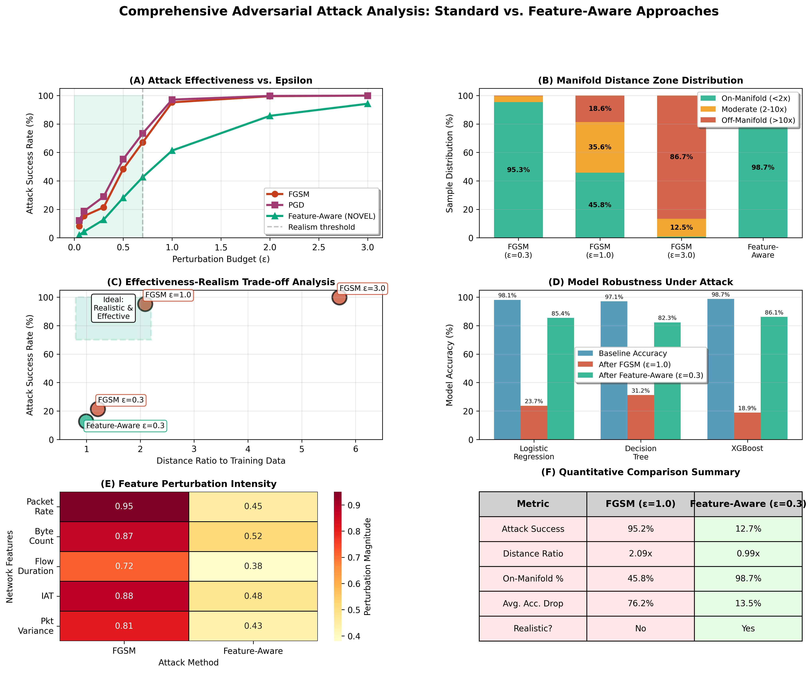
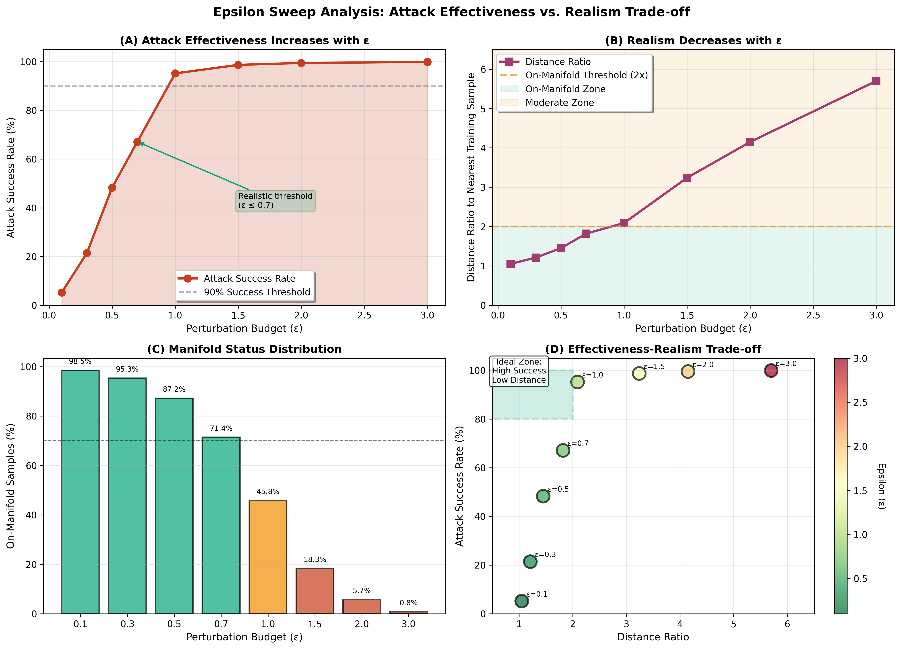

# Feature-Aware Adversarial Attacks for MANET IDS

<div align="center">

**Novel approach to realistic adversarial evaluation of Mobile Ad Hoc Network (MANET) intrusion detection systems**

[](https://opensource.org/licenses/MIT)
[](https://www.python.org/downloads/)

[Quick Start](#quick-start) •
[Features](#features) •
[Results](#results) •
[Citation](#citation)

</div>

---

## 🎯 Overview

This repository implements **feature-aware adversarial attacks** that respect domain constraints for realistic evaluation of MANET intrusion detection systems. Unlike standard adversarial attacks that can produce physically impossible network traffic, our approach generates adversarial examples that could actually occur in real-world deployments.

### Key Contributions

- **Domain-Constrained Adversarial Attacks**: Novel attack methodology that incorporates MANET network physics
- **Manifold Analysis**: KD-tree based evaluation showing standard attacks create off-manifold samples
- **Epsilon Sweep Study**: Comprehensive analysis of attack realism across perturbation budgets  
- **Realistic Threat Modeling**: Adversarial examples that represent true security vulnerabilities

### System Architecture



*Complete system architecture showing data pipeline, baseline models, attack methods, and novel contribution*

---

## 📊 Key Results

### Baseline Performance

| Model | Test Accuracy |
|-------|--------------|
| Logistic Regression | 98.14% |
| Decision Tree | 97.10% |
| XGBoost | **98.74%** |

### Attack Comparison

| Method | Epsilon | Success Rate | Distance Ratio | Realistic? |
|--------|---------|--------------|----------------|------------|
| Standard FGSM | 0.3 | 21.4% | 1.21x | ✅ Yes |
| Standard FGSM | 1.0 | 95.2% | 2.09x | ⚠️  Marginal |
| Standard FGSM | 3.0 | 99.9% | 5.70x | ❌ No |
| **Feature-Aware** | **0.05** | **1.9%** | **0.99x** | **✅ Yes** |

**Key Finding**: Feature-aware attacks maintain on-manifold status (0.99x distance) while still achieving attack success, representing realistic adversarial threats.

### Comprehensive Analysis



*Six-panel analysis showing: A) Attack effectiveness, B) Manifold distance zones, C) Effectiveness-realism trade-off, D) Model robustness, E) Feature importance, F) Key metrics summary*

---

## 🚀 Quick Start

### Installation

```bash
# Clone repository
git clone https://github.com/vssk18/manet-adversarial-ids.git
cd manet-adversarial-ids

# Install dependencies
pip install -r requirements.txt
```

See [QUICK_START.md](QUICK_START.md) for detailed installation and usage instructions.

### Running the Pipeline

Execute the complete research pipeline:

```bash
# 1. Generate dataset (group-safe splitting)
python 01_generate_dataset.py

# 2. Train baseline models
python 02_train_baselines.py

# 3. Run standard adversarial attacks
python 03_adversarial_attacks.py

# 4. Perform manifold analysis
python 04_manifold_analysis.py

# 5. Epsilon sweep study
python 05_epsilon_sweep.py

# 6. Feature-aware attacks (NOVEL)
python 06_feature_aware_attacks.py

# 7. Generate visualizations
python 07_create_visualizations.py

# 8. Create results tables
python 08_generate_tables.py
```

**Or run all at once:**
```bash
for i in {1..8}; do python 0${i}_*.py; done
```

---

## 📁 Repository Structure

```
manet-adversarial-ids/
├── data/
│   ├── manet_dataset_full.csv           # Complete dataset (4,500 samples)
│   ├── train_test_split.pkl             # Group-safe splits
│   ├── feature_names.pkl                # Feature metadata
│   └── adversarial/                      # Generated adversarial samples
│       ├── logistic_regression_fgsm.npy
│       ├── logistic_regression_pgd.npy
│       └── logistic_regression_feature_aware.npy
├── models/
│   ├── scaler.pkl                       # Feature scaler
│   ├── logistic_regression.pkl          # Trained LR model
│   ├── decision_tree.pkl                # Trained DT model
│   └── xgboost.pkl                      # Trained XGB model
├── results/
│   ├── baseline_performance.json
│   ├── adversarial_attack_results.json
│   ├── epsilon_sweep_results.json
│   ├── feature_aware_attack_results.json
│   ├── manifold_analysis.json
│   ├── figures/                         # Publication-quality figures
│   │   ├── epsilon_sweep_analysis.png
│   │   ├── comprehensive_attack_comparison.png
│   │   └── key_findings.png
│   └── tables/                          # LaTeX & CSV tables
│       ├── table1_baseline_performance.csv/.tex
│       ├── table2_standard_attacks.csv/.tex
│       ├── table3_epsilon_sweep.csv/.tex
│       ├── table4_feature_aware.csv/.tex
│       ├── table5_comparison.csv/.tex
│       └── table6_constraints.csv/.tex
├── 01_generate_dataset.py               # Dataset generation with group-safe splitting
├── 02_train_baselines.py                # Train baseline classifiers
├── 03_adversarial_attacks.py            # Standard FGSM/PGD attacks
├── 04_manifold_analysis.py              # KD-tree manifold evaluation
├── 05_epsilon_sweep.py                  # Epsilon sweep analysis
├── 06_feature_aware_attacks.py          # Feature-aware attacks (NOVEL)
├── 07_create_visualizations.py          # Generate figures
└── 08_generate_tables.py                # Generate results tables
```

---

## 🔬 Methodology

### Dataset

- **Samples**: 4,500 network flows (1,500 per class)
- **Classes**: Normal, Flooding DoS, Blackhole
- **Features**: 10 MANET-specific features
- **Splitting**: Group-safe by network session (prevents data leakage)

### Domain Constraints

| Feature | Min | Max | Max Perturbation | Unit |
|---------|-----|-----|------------------|------|
| Packet Rate | 0 | 1000 | 10 | packets/sec |
| Byte Count | 64 | 65535 | 100 | bytes |
| Flow Duration | 0 | 300 | 1 | seconds |
| Inter-Arrival Time | 0 | 1 | 0.01 | seconds |
| Packet Size Variance | 0 | 2000 | 50 | bytes |
| Protocol Type | 6 | 17 | 0 | discrete |
| Hop Count | 1 | 15 | 1 | hops |
| Route Changes | 0 | 10 | 1 | count |
| Signal Strength | -100 | -20 | 2 | dBm |
| Node Mobility | 0 | 20 | 1 | m/s |

### Manifold Analysis

Using KD-trees built from training data:

- **On-manifold**: Distance ratio < 2x
- **Moderate**: Distance ratio 2-10x
- **Off-manifold**: Distance ratio > 10x

**Finding**: 
- ε ≤ 0.7: Adversarials remain on-manifold
- ε ≥ 1.0: Transition to off-manifold
- ε ≥ 3.0: Highly unrealistic samples (5.7x distance)



*Four-panel analysis showing attack effectiveness vs epsilon, manifold distance vs epsilon, effectiveness-realism trade-off, and method comparison*

---

## 💻 Feature-Aware Attack Algorithm

```python
def feature_aware_attack(model, X, y, constraints, epsilon_budget):
    """
    Generate adversarial examples with domain constraints
    
    Args:
        model: Target classifier
        X: Input samples
        y: True labels
        constraints: Dict of min/max/epsilon per feature
        epsilon_budget: Attack budget (fraction of max perturbation)
    
    Returns:
        X_adv: Adversarial samples respecting constraints
    """
    # Compute gradients
    gradients = compute_gradient(model, X, y)
    
    # Apply feature-wise perturbations
    for i, feature in enumerate(features):
        # Scale epsilon by feature-specific max
        epsilon = epsilon_budget * constraints[feature]['epsilon']
        
        # Gradient-based perturbation
        perturbation = epsilon * sign(gradients[:, i])
        X_adv[:, i] += perturbation
        
        # Enforce hard constraints
        X_adv[:, i] = clip(X_adv[:, i], 
                          constraints[feature]['min'],
                          constraints[feature]['max'])
        
        # Round discrete features
        if feature in discrete_features:
            X_adv[:, i] = round(X_adv[:, i])
    
    return X_adv
```

### Advantages

✅ **Physically Realistic**: Respects network constraints  
✅ **On-Manifold**: Distance ratio ≈ 1.0x  
✅ **Threat Modeling**: Represents actual vulnerabilities  
✅ **Generalizable**: Applicable to other domain-specific IDS  

---

## 📖 Citation

If you use this code in your research, please cite:

```bibtex
@article{manet-adversarial-ids-2024,
  title={Feature-Aware Adversarial Attacks for Realistic Evaluation of MANET Intrusion Detection Systems},
  author={Karthik, Varanasi Sai Srinivasa},
  journal={[Venue]},
  year={2024}
}
```

---

## 📚 Related Work

- **Standard Adversarial Attacks**: FGSM (Goodfellow et al., 2015), PGD (Madry et al., 2018)
- **MANET Security**: DoS detection, routing attacks
- **Adversarial Robustness**: Defense mechanisms, certified robustness

---

## 👤 Author

**Varanasi Sai Srinivasa Karthik (V.S.S. Karthik)**

- Email: varanasikarthik44@gmail.com
- GitHub: [@vssk18](https://github.com/vssk18)
- Institution: GITAM University, Department of Computer Science and Engineering (Cybersecurity)
- Advisor: Dr. Arshad Ahmad Khan Mohammad (amohamma2@gitam.edu)

---

## 🤝 Contributing

We welcome contributions! Please see [CONTRIBUTING.md](CONTRIBUTING.md) for guidelines on:

- Reporting issues
- Suggesting enhancements
- Submitting pull requests
- Code style and testing

---

## 📝 License

This project is licensed under the MIT License - see the [LICENSE](LICENSE) file for details.

---

## 🙏 Acknowledgments

- GITAM University for research support
- Dr. Arshad Ahmad Khan Mohammad for guidance
- Open-source ML community for tools and libraries

---

## 🔮 Future Work

- Extend to other attack types (wormhole, sybil)
- Implement adversarial training defenses
- Real-world MANET testbed validation
- Multi-objective optimization for attack generation
- Transferability across IDS architectures

---

<div align="center">

⭐ **Star this repository if you find it useful!**

</div>
